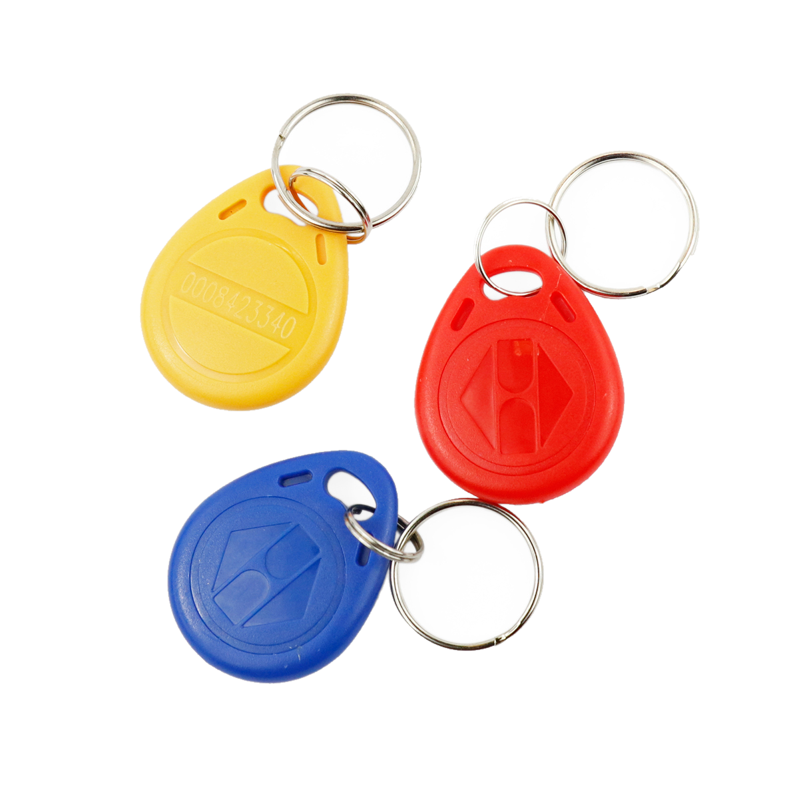

# RFID-Transponder

## Beschreibung
RFID bezeichnet ein Sender-Empfänger-System, das vor allem zur eindeutigen Identifizierung von Objekten, Einkaufswaren oder auch Lebewesen eingesetzt wird. Der abgebildete RFID-Transponder hat die Form eines Schlüsselanhängers und einer Kreditkarte und besitzt eine eindeutige Identifikationsnummer. Die Identifikationsnummer wird vom Lesegerät ausgelesen, sobald der Transponder in seine unmittelbare Nähe gehalten wird. Der Transponder benötigt dabei keine Stromversorgung, da das Auslesegerät ihn kontaktlos mit Energie versorgt.

Mit der RFID-Technologie lässt sich beispielsweie ein Haustür-Schloss automatisieren. Individuelle RFID-Transponder müssen dann an das entsprechende Lesegerät gehalten werden und könnten so einen Schlüssel ersetzen. Bei Verlust eines Transponders ließe sich dieser nachträglich ohne Austausch des Schlosses aus dem System sperren.

Alle weiteren Hintergrundinformationen sowie ein Beispielaufbau und alle notwendigen Programmbibliotheken sind auf dem offiziellen Wiki (bisher nur in englischer Sprache) von Seeed Studio zusammengefasst. Zusätzlich findet man über alle gängigen Suchmaschinen meist nur mit der Eingabe der genauen Komponenten-Bezeichnungen entsprechende Projektbeispiele und Tutorials.

@[youtube](https://www.youtube.com/watch?v=dJXTgtIMUPw)

## Beispiele

!!!show-examples:./examples/

<!-- infolist -->

## Wichtige Links für die ersten Schritte:

- [Produktseite - RFID Chip](https://www.seeedstudio.com/rfid-tag-combo-125khz-5-pcs-p-700.html?cPath=19_24)
- [Seeed Studio Wiki -](http://wiki.seeedstudio.com/Grove-125KHz_RFID_Reader/) [RFID Lesegerät](http://wiki.seeedstudio.com/Grove-125KHz_RFID_Reader/)

## Projektbeispiele:

- [Hackster - Haus-Sicherheitssystem](https://www.hackster.io/ArduinoBasics/arduino-based-security-project-using-cayenne-eb379b)

## Weiterführende Hintergrundinformationen:

- [RFID - Wikipedia Artikel](https://de.wikipedia.org/wiki/RFID)

